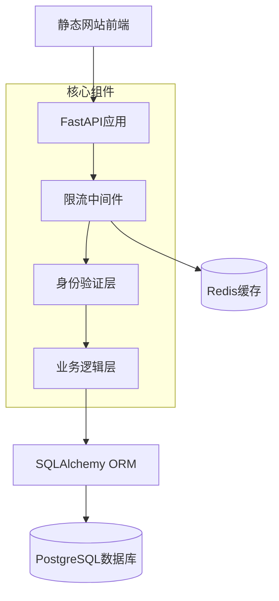
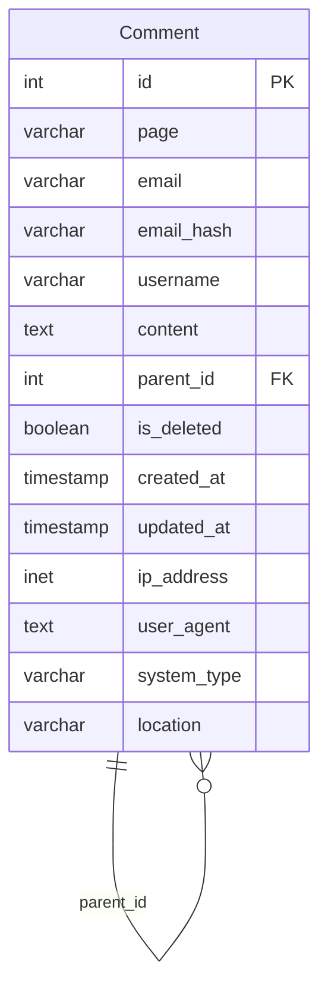
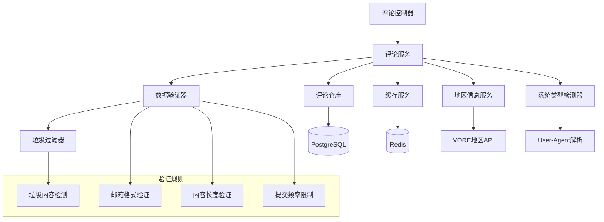
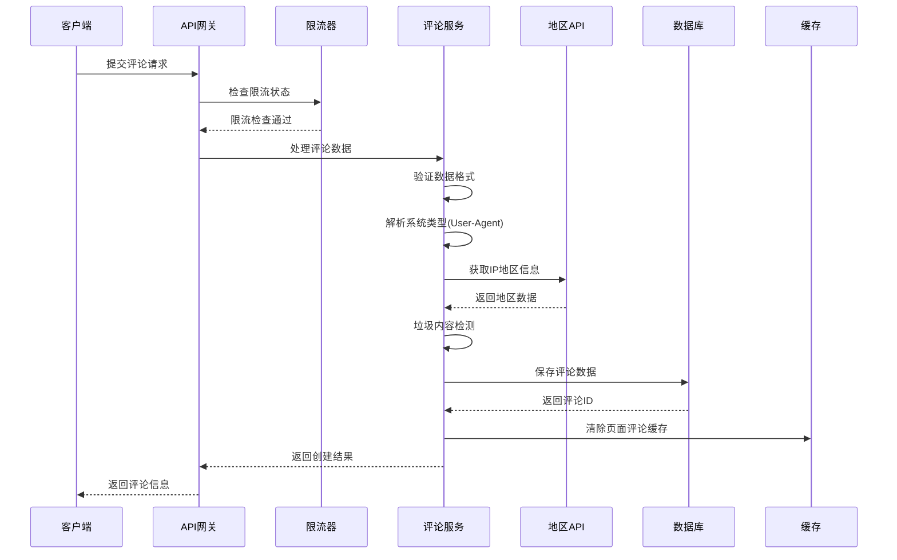
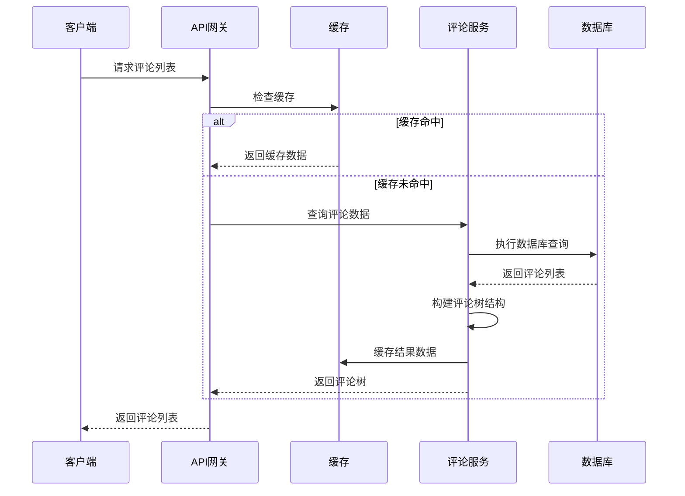
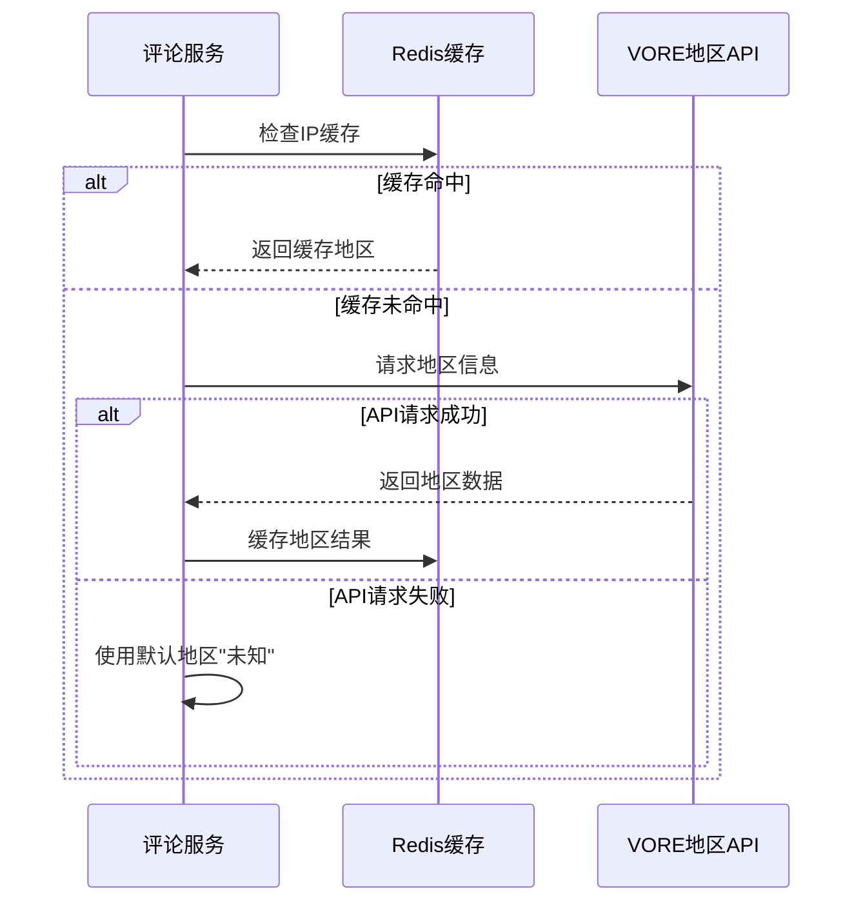
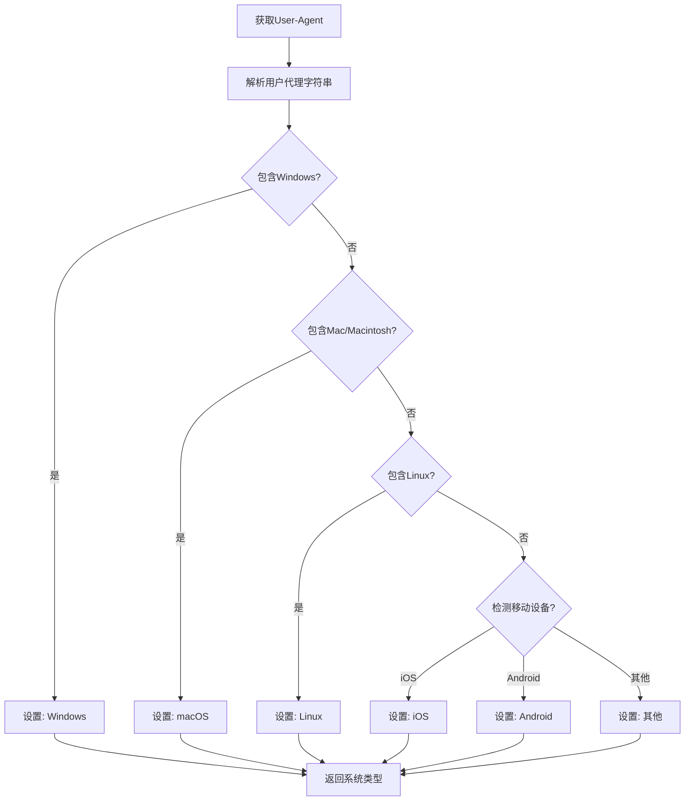
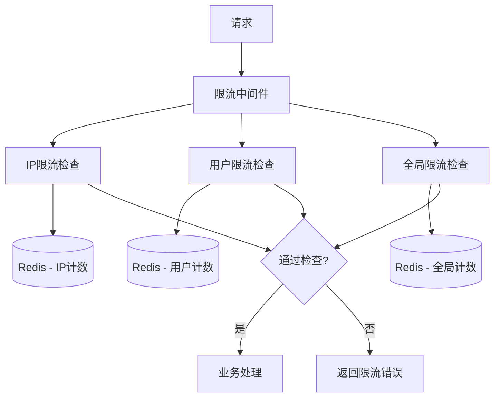
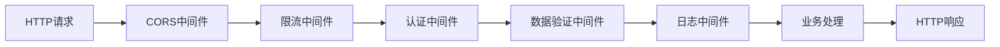
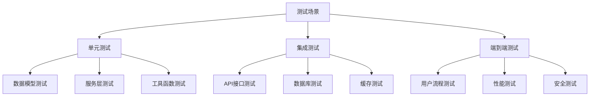

# 静态网站评论系统后端设计文档

## 概述

本系统为静态网站提供评论功能的后端服务，采用FastAPI框架和PostgreSQL数据库实现。系统支持嵌套回复、用户身份验证、限流保护等核心功能，确保为静态网站提供稳定可靠的评论服务。

### 核心价值
- 为静态网站提供动态评论交互能力
- 支持多层级嵌套回复，提升用户讨论体验
- 实现有效的反垃圾评论和限流机制
- 提供简洁易用的RESTful API接口

### 技术栈
- **后端框架**: FastAPI (Python)
- **数据库**: PostgreSQL
- **ORM**: SQLAlchemy
- **限流**: slowapi (基于Redis)
- **验证**: Pydantic
- **部署**: Docker + Docker Compose

## 架构设计

### 系统架构图



### 分层架构

| 层级 | 职责 | 主要组件 |
|------|------|----------|
| API接口层 | 处理HTTP请求响应 | FastAPI路由、中间件 |
| 业务逻辑层 | 核心业务规则处理 | 评论服务、验证服务 |
| 数据访问层 | 数据持久化操作 | SQLAlchemy模型、仓库模式 |
| 基础设施层 | 缓存、限流、日志 | Redis、限流器、日志系统 |

## API接口设计

### 核心接口规范

| 接口 | 方法 | 路径 | 描述 | 限流 |
|------|------|------|------|------|
| 获取评论列表 | GET | `/api/comments` | 获取指定页面的评论树 | 10/分钟 |
| 提交评论 | POST | `/api/comments` | 创建新评论或回复 | 5/分钟 |
| 删除评论 | DELETE | `/api/comments/{id}` | 软删除评论（管理员） | 无限制 |

### 请求响应模型

#### 提交评论请求
```json
{
  "page": "string",            // 页面唯一标识
  "email": "string",           // 用户邮箱
  "username": "string",        // 用户显示名称
  "content": "string",         // 评论内容
  "parent_id": "integer|null"  // 父评论ID，null表示顶级评论
}
```

#### 评论响应模型
```json
{
  "id": "integer",
  "page": "string",
  "email_hash": "string",      // 邮箱MD5哈希（用于头像）
  "username": "string",
  "content": "string",
  "parent_id": "integer|null",
  "created_at": "datetime",
  "updated_at": "datetime",
  "children": [...]            // 嵌套子评论
}
```

#### 评论列表响应
```json
{
  "comments": [...],           // 评论树结构
  "total": "integer",          // 总评论数
  "page": "integer",
  "page_size": "integer"
}
```

## 数据模型设计

### 评论表结构

| 字段名 | 类型 | 约束 | 描述 |
|--------|------|------|------|
| id | SERIAL | PRIMARY KEY | 评论唯一标识 |
| page | VARCHAR(200) | NOT NULL, INDEX | 页面唯一标识 |
| email | VARCHAR(255) | NOT NULL | 用户邮箱 |
| email_hash | VARCHAR(32) | NOT NULL | 邮箱MD5哈希 |
| username | VARCHAR(100) | NOT NULL | 用户显示名称 |
| content | TEXT | NOT NULL | 评论内容 |
| parent_id | INTEGER | FOREIGN KEY | 父评论ID |
| is_deleted | BOOLEAN | DEFAULT FALSE | 软删除标记 |
| created_at | TIMESTAMP | DEFAULT NOW() | 创建时间 |
| updated_at | TIMESTAMP | DEFAULT NOW() | 更新时间 |
| ip_address | INET | - | 用户IP地址 |
| user_agent | TEXT | - | 用户代理信息 |
| system_type | VARCHAR(50) | - | 操作系统类型 |
| location | VARCHAR(100) | - | 用户地区信息 |

### 索引策略

| 索引名 | 字段 | 类型 | 用途 |
|--------|------|------|------|
| idx_page | page | B-tree | 按页面查询评论 |
| idx_parent_id | parent_id | B-tree | 查询子评论 |
| idx_created_at | created_at | B-tree | 时间排序 |
| idx_email_ip | email, ip_address | 复合 | 限流和垃圾检测 |

### 数据关系图



## 业务逻辑层设计

### 评论服务架构



### 核心业务流程

#### 评论提交流程



#### 评论查询流程



### 数据验证规则

| 字段 | 验证规则 | 错误信息 |
|------|----------|----------|
| email | 邮箱格式、长度≤255 | "请输入有效的邮箱地址" |
| username | 长度2-100字符、不含特殊字符 | "用户名长度应在2-100字符之间" |
| content | 长度10-2000字符、不含恶意内容 | "评论内容长度应在10-2000字符之间" |
| page | 字符串格式、长度≤200 | "请提供有效的页面标识" |
| parent_id | 存在且未删除的评论ID | "回复的评论不存在" |

### 地区信息获取服务

#### VORE API集成设计

| 功能组件 | 实现方式 | 配置参数 |
|----------|----------|----------|
| API客户端 | HTTP异步请求 | 超时时间: 3秒 |
| 缓存策略 | Redis缓存IP结果 | 缓存时长: 24小时 |
| 失败处理 | 降级到默认值 | 默认地区: "未知" |
| 重试机制 | 指数退避重试 | 最大重试: 2次 |

#### 地区信息处理流程



### 系统类型检测服务

#### User-Agent解析规则

| 系统类型 | 检测关键词 | 优先级 |
|----------|------------|--------|
| Windows | Windows NT, Windows | 高 |
| macOS | Macintosh, Mac OS X, macOS | 高 |
| Linux | Linux, Ubuntu, CentOS | 高 |
| iOS | iPhone, iPad, iPod | 中 |
| Android | Android | 中 |
| 其他 | 未匹配任何规则 | 低 |

#### 系统检测逻辑



## 限流与安全机制

### 限流策略设计

| 限流类型 | 策略 | 限制 | 时间窗口 |
|----------|------|------|----------|
| IP限流 | 滑动窗口 | 10次/分钟 | 60秒 |
| 用户限流 | 令牌桶 | 5次/分钟 | 60秒 |
| 全局限流 | 计数器 | 1000次/分钟 | 60秒 |
| 邮箱限流 | 固定窗口 | 3次/小时 | 3600秒 |

### 限流实现架构



### 安全防护措施

| 安全机制 | 实现方式 | 防护目标 |
|----------|----------|----------|
| SQL注入防护 | ORM参数化查询 | 恶意SQL攻击 |
| XSS防护 | 内容转义和过滤 | 跨站脚本攻击 |
| CSRF防护 | CORS配置 | 跨站请求伪造 |
| 内容过滤 | 关键词检测 | 垃圾和恶意内容 |
| 邮箱验证 | 格式验证+存在性检查 | 虚假邮箱 |

## 中间件与拦截器

### 中间件执行链



### 中间件职责分工

| 中间件 | 职责 | 处理内容 |
|--------|------|----------|
| CORS中间件 | 跨域访问控制 | 设置允许的域名、方法、头部 |
| 限流中间件 | 请求频率控制 | 检查IP、用户、全局请求频率 |
| 认证中间件 | 身份验证 | 验证管理员token（删除操作） |
| 验证中间件 | 数据格式验证 | 检查请求数据格式和完整性 |
| 用户信息中间件 | 用户环境检测 | 解析IP地址、系统类型、地区信息 |
| 日志中间件 | 请求日志记录 | 记录请求详情和响应状态 |
| 异常中间件 | 全局异常处理 | 统一异常响应格式 |

### 异常处理策略

| 异常类型 | HTTP状态码 | 响应格式 | 处理方式 |
|----------|------------|----------|----------|
| 数据验证错误 | 400 | 详细字段错误信息 | 返回具体验证失败原因 |
| 限流触发 | 429 | 限流信息和重试时间 | 返回Retry-After头 |
| 资源不存在 | 404 | 简单错误信息 | 记录访问日志 |
| 地区API超时 | 200 | 正常处理，地区显示"未知" | 记录API调用失败日志 |
| 服务器错误 | 500 | 通用错误信息 | 详细错误日志记录 |
| 数据库连接错误 | 503 | 服务不可用 | 自动重试机制 |

## 测试策略

### 单元测试覆盖

| 测试模块 | 测试重点 | 覆盖率目标 |
|----------|----------|------------|
| 数据模型 | 字段验证、关系约束 | 95% |
| 业务服务 | 核心业务逻辑 | 90% |
| API接口 | 请求响应处理 | 85% |
| 限流机制 | 各种限流场景 | 100% |
| 数据验证 | 各种输入验证 | 95% |
| 地区服务 | API调用、缓存、降级 | 90% |
| 系统检测 | User-Agent解析 | 85% |

### 测试场景设计

#### 功能测试场景



#### 关键测试用例

| 测试类型 | 测试用例 | 验证目标 |
|----------|----------|----------|
| 正常流程 | 用户提交有效评论 | 评论成功保存和返回 |
| 边界条件 | 最大长度内容提交 | 内容长度验证正确 |
| 异常处理 | 无效邮箱格式提交 | 返回正确错误信息 |
| 并发测试 | 同时提交大量评论 | 限流机制正常工作 |
| 安全测试 | SQL注入攻击尝试 | 系统安全防护有效 |
| 性能测试 | 大量评论查询 | 响应时间满足要求 |

### 测试数据管理

| 数据类型 | 管理方式 | 清理策略 |
|----------|----------|----------|
| 基础测试数据 | Fixture文件 | 测试后自动清理 |
| 性能测试数据 | 数据生成器 | 定期批量清理 |
| 集成测试数据 | Docker容器 | 容器销毁时清理 |

这个设计文档完整地定义了静态网站评论系统后端的架构和实现策略，确保系统具备高可用性、安全性和可扩展性。